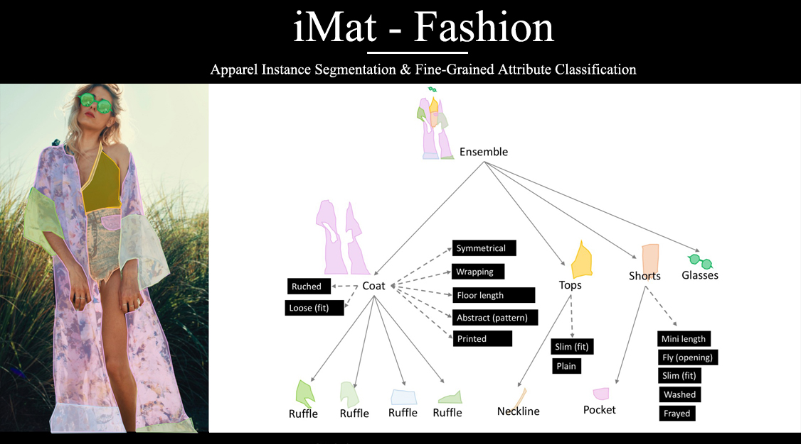
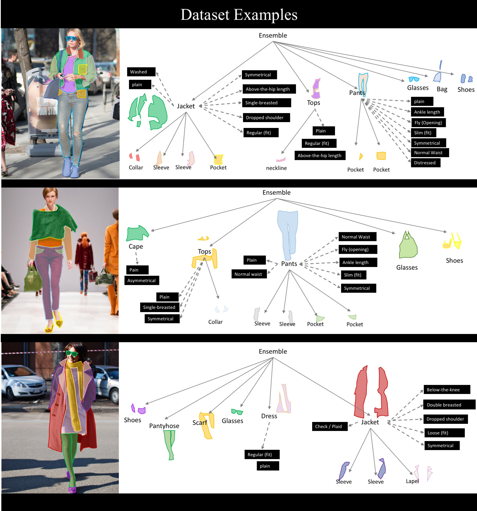
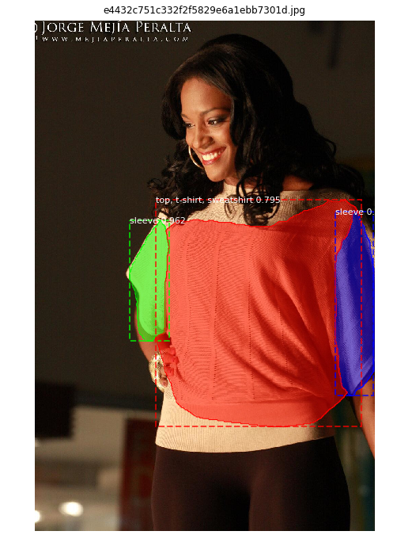
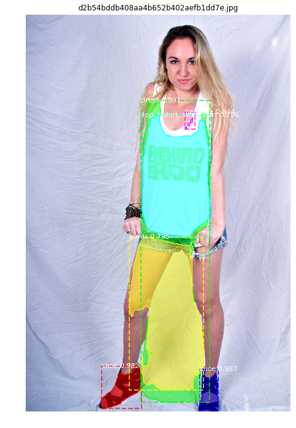

# Mask-RCNN-for-fashion-Kaggle-iMaterialist-
Being able to recognize apparel products and associated attributes from pictures could enhance the shopping experience for consumers, and increase work efficiency for fashion professionals.The task is to unify both categorization and segmentation of rich and complete apparel attributes, needed for real world-applications.

